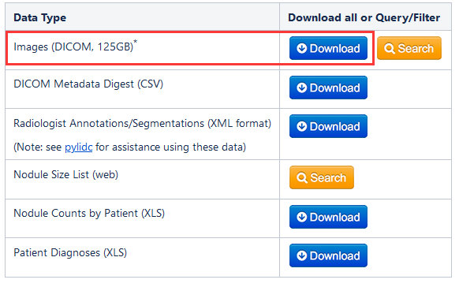

# AlexNet CNN Lung Detection 

- Brief: Directory involve *CT Lung Nodule Detection Scripts*, testing accuracy of LUNG NODULE DETECTION using AlexNet convolutional neural network.
- Requirements: 
  - Python3.6,Python2.7(execute caffe pyscript)
  - caffe-windows
  - Win10

## 1. Preparation

#### i. Data collection

- download LIDC-IDRI Dataset from:  https://wiki.cancerimagingarchive.net/display/Public/LIDC-IDRI#dbf22419dbb1415080c3adfd39cdc651

- place the dataset in directory `./LIDC-IDRI`

#### ii. Python configuration

- make sure python 3.6 is available
- packages : `pip install pydicom opencv-python scikit-image`

#### iii. Caffe installation

- git clone to `.\microsoft-caffe\caffe` from : https://github.com/happynear/caffe-windows 

- install and compile Caffe on windows, following steps from `caffe-windows` *Windows Setup* carefully 

   https://github.com/happynear/caffe-windows/blob/ms/README.md *(This step will take a long time)*

- make sure the files in this project under `.\microsoft-caffe\caffe` still exist after install Caffe sucessfully  (***important***)

  

## 2. Generate Training Set

#### i. Before images preprocess

- generate a pickle pointer-file with python3.7:  `python .\pyprocessing\loadpath.py`
- make sure the existence of `\TCIA_METADATA\tcia-diagnosis-data-2012-04-20.csv`

#### ii. Parenchymal templates generation&candidate nodules cropping

- `python .\pyprocessing\start.py`

  *(This process will take a long time)*

#### iii. Results

- candidate lung nodules and healthy tissues will categorized under `.\TrainingSet`
- process files & images will saved under `.\pyprocessing\imageBasket\LPT`

## 3. AlexNet CNN Training

#### i. Generate category texts

- execute ` python .\pyprocessing\label_generate.py`  

  (`test.txt train.txt val.txt` will be created for Caffe training)

- copy images training set to caffe :`xcopy .\TrainingSet  .\microsoft-caffe\caffe\data\nodulesdetect /e /q`

- copy 3 text files `test.txt, train.txt, val.txt`  under `.\pyprocessing` to `.\microsoft-caffe\caffe\data\nodulesdetect\`

#### ii. Generate Lmdb & mean files (Caffe)

- go to the directory of Caffe, such as `cd .\microsoft-caffe\caffe\ `

- Lmdb validation set : `Build\x64\Release\convert_imageset.exe --shuffle --resize_height=64 --resize_width=64 data\nodulesdetect\ data\nodulesdetect\val.txt data\nodulesdetect\val_lmdb`

- Lmdb training set : `Build\x64\Release\convert_imageset.exe --shuffle --resize_height=64 --resize_width=64 data\nodulesdetect\ data\nodulesdetect\train.txt data\nodulesdetect\train_lmdb`

- mean binary file : `Build\x64\Release\compute_image_mean.exe data\nodulesdetect\train_lmdb data\nodulesdetect\mean.binaryproto`

#### iii. Training

- adjust model parameters under `.\microsoft-caffe\caffe\models\noduledetectmt2` (***important***)

- start training : `Build\x64\Release\caffe.exe train --solver=models\noduledetectmt2\solver.prototxt >log\alexnet_noduledetection_round1.log 2>&1`

  *(This step will take a long time)*

  

## 4. Testing

- make sure the existence of `.\microsoft-caffe\caffe\data\nodulesdetect\labels.txt`
- set using of  python 2.7

- start testing : Under directory `.\microsoft-caffe\caffe\` and execute`python testresult.py  `

- check result under `.\microsoft-caffe\caffe\data\nodulesdetect\test_re.npy`
- analysis : function `drawroc()` in `testresult.py`

## 5. Other

#### i. Process of lung parenchyma segmentation

#### ii. RGB 3 channels Stacking

